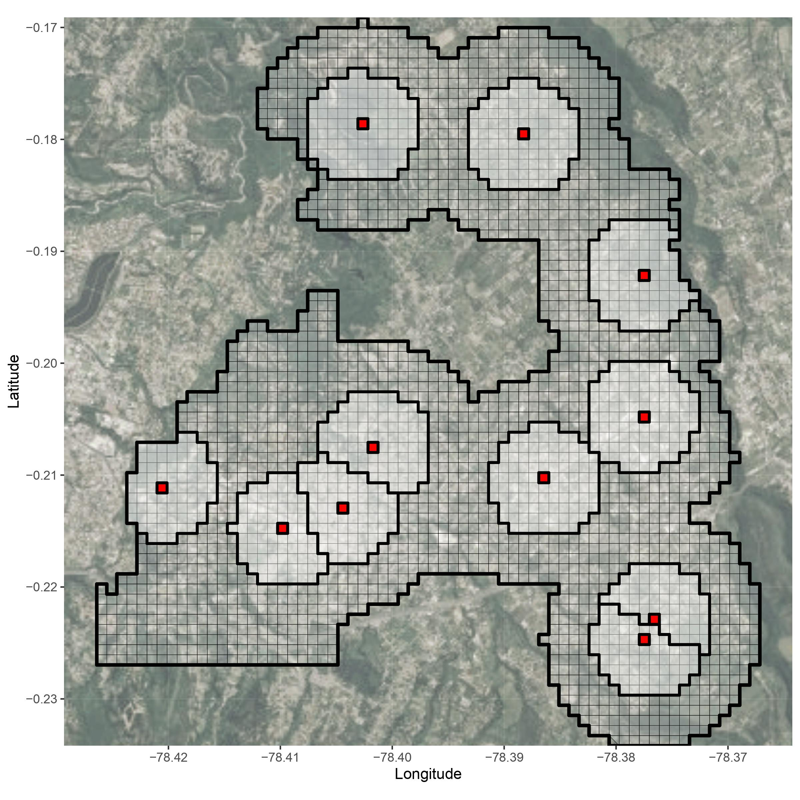
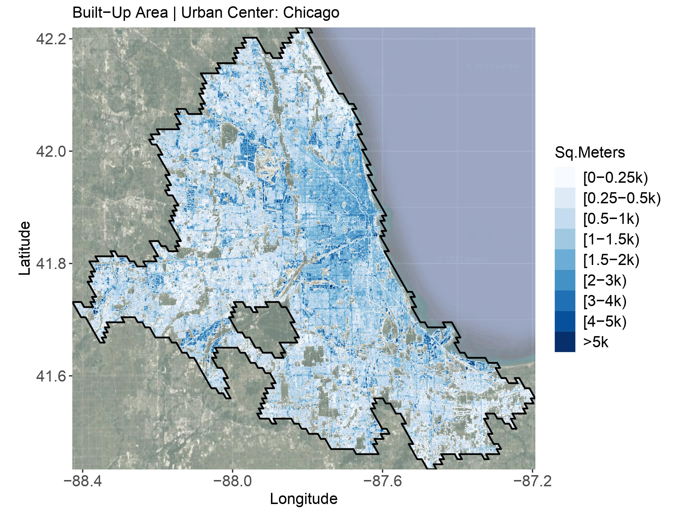

## Working Papers:

<ol>
    <li>
        <strong style="margin-bottom: 10px; display: block;">Police-Monitored Cameras and Crime: Evidence from a Nationwide Policy (with <a href="https://sites.google.com/site/pdomingr/">Patricio Dominguez</a>)</strong>
        

            
            <small style="margin-left: 10px;">Police departments around the world invest heavily in crime prevention technologies. In the US, virtually every local police department has a video-surveillance system in place or access to one. This paper studies a nationwide police video-surveillance policy implemented in Ecuador in 2012. By 2019, it had presence in over 45% of parishes and surveilled over 30% of all urban space. The gradual rollout of the policy across time and space allows us to estimate its short and medium-term effect on crime. We use (i) maps representing urban centers, and unique georeferenced administrative data on the (ii) universe of reported crimes to the police - 447k incidents - and (iii) emergency calls made to the 911 system - 2.2m calls - to construct a panel at the city block-month level. Our spatial design allows us to exploit variation in proximity to installation sites to estimate potential displacement effects. We find that on aggregate cameras decreased crimes by around 12%. However, that aggregate masks two opposing effects: a decrease within surveilled blocks and displacement to unsurveilled blocks. We also find that the effects are concentrated within poor, more populated, and urban settings. Using a back-of-the-envelope calculation our result suggests a drop of around 5.8k less reported crimes in a given year. Our findings indicate that video-surveillance systems can be an effective city-level crime prevention policy especially within contexts where policing is costly and challenging.
              <strong>Presented:</strong> Washington Area Development Economics Symposium (WADES), Applied Micro BB and Development Tea @GWU.
             <strong>Upcoming:</strong> Virtual Crime Economics (ViCE) Seminar Series, SEA 94th Annual Meetings and APPAM Fall 2024 Research Conference. </small>
        

    </li>
    <li>
        <strong style="margin-bottom: 10px; display: block;">Stylized Facts on the Global Distribution of Volume Gradients (with <a href="https://www.remijedwab.com/">Remi Jedwab</a>, <a href="https://www.worldbank.org/en/about/people/k/klaus-deininger">Klaus Deininger</a>, and <a href="https://scholar.google.de/citations?user=g2OVq2cAAAAJ&hl=de">Thomas Esch</a>)</strong>
        

            
            <small style="margin-left: 10px;">While urban economists have studied the spatial distribution of population, economic activities, and physical structures intensively for the past 60 years, this paper is one of the first attempts to examine urban form systematically around the world. Using global satellite-based high-resolution (90m×90m) data on building volumes, as well as a novel database of historical city centers, we consistently estimate volume density gradients for 7,000 cities capturing most of the world’s total urban population today. Density gradients are flatter in more populated cities and wealthier cities. However, once we control for the horizontal land expansion effect of population size and economic size, population and wealth (per area, i.e., their density) lead to steeper gradients, implying taller buildings in more central areas vs. more peripheral areas. Transportation infrastructure flattens gradients but more subway construction per land area steepens gradients. Historically segregated cities and former colonies of anglophone countries also have flatter gradients. In contrast, thirty years after the fall of the Berlin Wall, cities in former communist countries do not exhibit flatter gradients. Lastly, more historical cities have flatter gradients. Overall, our global analysis both corroborates and contradicts results from previous important studies on the topic.</small>
        

    </li>
        <li>
        <strong style="margin-bottom: 10px; display: block;">Crime-Differential Responses to an Environmental Shock: Evidence from Blackouts (with <a href="https://sites.google.com/site/pdomingr/">Patricio Dominguez</a>)</strong>
        

            
            <small style="margin-left: 10px;">We examine how the supply of offenses respond to a large environmental shock in the urban space. We focus on blackouts which can abruptly change the provision of light, and potentially the distribution of criminal opportunities. Using high-frequency administrative data on more than 370,000 power outage incidents reported in Chile during 2014-2015, we analyze how they affect crime along several dimensions. We find no significant effect on the aggregate crime rate, but we also find two offsetting reactions driving this result: a positive effect in burglary, and a negative effect on robbery and thefts. By exploiting unique features of the data, we analyze several dimensions of treatment effect heterogeneity regarding the magnitude, size and duration of the blackout. In addition, we find that crime responses differ by municipality socio-economic status. We validate our findings by conducting a set of placebo exercises where we find no meaningful variation across different crime types and treatment definitions. Our results suggest that criminals react to changes in incentives by carrying out crimes that yield a higher expected return.
              <strong>Presented:</strong> Development Tea @GWU.
             <strong>Co-author Presented:</strong> AL CAPONE Workshop, Virtual Crime Economics (ViCE) Seminar Series, Temple University, Universidad de San Andres, and IADB Research Department.</small>
        

    </li>
</ol>

## Work in Progress:
<ol>
    <li><strong style="display: block;">Criminal Sentencing and Labor Market Outcomes (JMP)</strong></li>
    <li><strong style="display: block;">The Long-Term Global Effects of Earthquakes on Urban Growth (with <a href="https://www.remijedwab.com/">Remi Jedwab</a>)</strong></li>
</ol>

## Op-eds:

<ol>
    <li><strong style="display: block;">Ideas to safely reduce prison populations during the pandemic (Ideas Matter - May 2020)
        [<a href="https://blogs.iadb.org/ideas-matter/en/ideas-to-safely-reduce-prison-populations-during-the-pandemic/">English</a>]
        [<a href="https://blogs.iadb.org/ideas-que-cuentan/es/ideas-para-reducir-la-poblacion-carcelaria-de-manera-segura-ante-la-pandemia/">Español</a>]</strong></li>
    <li><strong style="display: block;">Pandemic and prisons: What are the challenges for Latin American countries? (Ideas Matter - April 2020)
        [<a href="https://blogs.iadb.org/ideas-matter/en/pandemic-and-prisons-what-are-the-challenges-for-latin-american-governments/">English</a>]
        [<a href="https://blogs.iadb.org/ideas-que-cuentan/es/la-pandemia-y-las-prisiones-cuales-son-los-desafios-para-los-gobiernos-de-america-latina/">Español</a>]</strong></li>
</ol>
